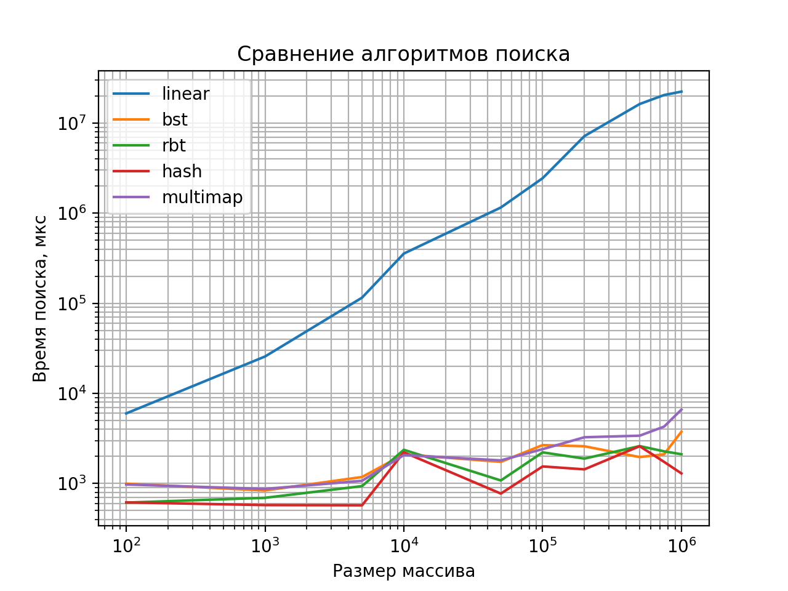
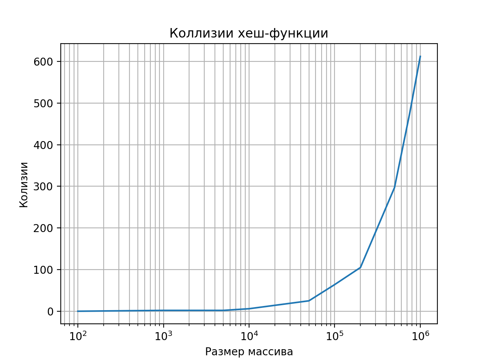

# 🔍 Сравнение алгоритмов поиска

Программа на C++ сравнивает производительность четырёх алгоритмов поиска:
- 🔹 **Линейный поиск**
- 🌳 **Бинарное дерево поиска (BST)**
- 🔴⚫ **Красно-чёрное дерево (RBT)**
- 🧮 **Хеш-таблица с цепочками**

Поиск выполняется по **ФИО**

---

## 📈 Графики производительности

| График                                | Описание |
|---------------------------------------|----------|
|  | Сравнение времени выполнения всех четырёх алгоритмов |
|       | Количество коллизий при поиске в хеш-таблице |

---

## 📄 Документация

Документация создана с помощью Doxygen и доступна локально по пути:

📁 `docs/html/index.html`  
📌 [Открыть документацию (локально)](docs/html/index.html)

---

## 🧠 Выводы

| Алгоритм поиска        | Сложность         | Особенности                                                                 |
|------------------------|-------------------|------------------------------------------------------------------------------|
| 🔹 Линейный поиск       | `O(n)`            | Очень простой, работает всегда, но неэффективен на больших массивах         |
| 🌳 Бинарное дерево поиска (BST) | `O(log n)` в среднем / `O(n)` в худшем | Быстрый при сбалансированных данных, но чувствителен к порядку вставки      |
| 🔴⚫ Красно-чёрное дерево (RBT) | `O(log n)`        | Самобалансирующееся дерево, надёжная и предсказуемая производительность     |
| 🧮 Хеш-таблица (откр. адресация) | `O(1)` в среднем / `O(n)` в худшем | Самый быстрый при правильной загрузке и хеш-функции, но сложнее в реализации |

> ✅ **Красно-чёрное дерево** — стабильный выбор для больших и изменяемых наборов данных.  
> ⚡ **Хеш-таблица** — наиболее производительная при хорошем коэффициенте загрузки.  
> 🌳 **BST** — прост, но теряет эффективность при несбалансированных данных.  
> 🔍 **Линейный поиск** — базовый метод, но медленный.

---

## 📎 Ссылка на репозиторий

🔗 https://github.com/AlSakharoB/lab2-search
